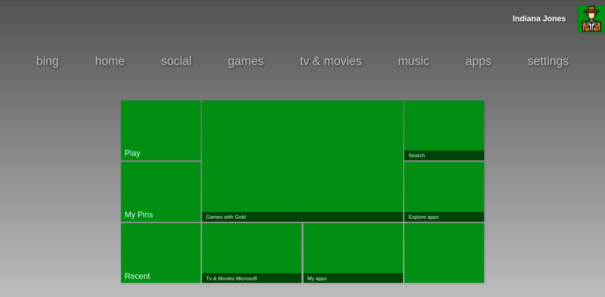

# Menu Xbox 360

### Sobre

Este projeto foi desenvolvido com a finalidade de aprimorar minhas habilidades em HTML5 e CSS3. O layout possui apenas uma parte do menu de um Xbox 360.




### 📌 Conteúdo

* [Sobre](#sobre)
* [Status](#status)
* [Características](#características)
* [Requisitos](#requisitos)
* [Tecnologias](#tecnologias)
* [Autor](#autor)
* [Licença](#licença)


### Status

Projeto finalizado ✅


### Características

- [x] Interação com o menu *home*


### Requisitos

1. O primeiro passo é clonar este repositório para algum local do computador
por meio do terminal ou cmd:

```bash
    $ git clone https://github.com/MatheusBibiano/XBOX-360-Menu
```

2. O próximo passo é colar o caminho para o arquivo **index.html** na URL do navegador.


### Tecnologias

A seguintes tecnologias foram utilizadas na construção do projeto:

- [HTML5](https://developer.mozilla.org/docs/Web/HTML)
- [CSS3](https://developer.mozilla.org/docs/Web/CSS)


### Autor


Matheus Bibiano Alves

[](https://www.linkedin.com/in/matheus-bibiano-alves) [](https://www.facebook.com/matheus.bibiano1/) [](https://twitter.com/Bibiano_Alves)


### Licença

[MIT](https://choosealicense.com/licenses/mit/)
